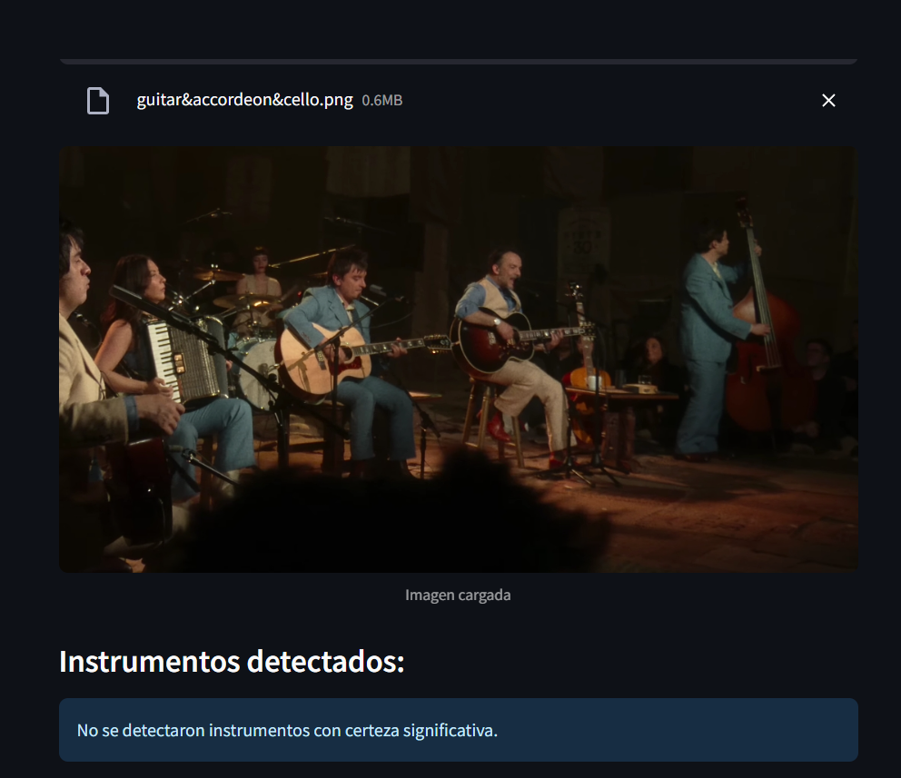

# Detección de instrumentos musicales mediante dos modelos de aprendizaje
- Celso Farías - Matías Isidín - Bastián Soto
- Aprendizaje de Máquinas NRC 8308
- Profesor: Matías Vargas
## Caso de Estudio: Gestión de Inventario en Entornos Musicales Profesionales

En estudios de grabación, salas de ensayo y orquestas profesionales, la gestión del inventario de instrumentos musicales es una tarea crítica pero comúnmente descuidada. El caos organizativo, la falta de trazabilidad y el error humano provocan pérdidas de instrumentos, mal uso del equipamiento y tiempos muertos valiosos para músicos e ingenieros de sonido.

A menudo, no se dispone de sistemas automatizados para verificar qué instrumentos están disponibles en una sala determinada, o si algún instrumento ha sido mal devuelto, trasladado o extraviado. Esta realidad impacta negativamente en la logística musical, la productividad de las sesiones y en ocasiones incluso en la calidad del trabajo profesional.

Frente a este problema, se plantea el desarrollo de un sistema de visión artificial capaz de detectar automáticamente los instrumentos presentes en una fotografía tomada en el estudio u orquesta. Con solo capturar una imagen, el sistema puede listar los instrumentos detectados, ayudando al equipo técnico a comparar rápidamente con el inventario esperado y tomar decisiones correctivas si es necesario.

Esta solución no solo mejora el orden y la eficiencia, sino que también aporta **valor directo al sector técnico-musical**, permitiendo una gestión proactiva del equipamiento, previniendo pérdidas, y facilitando auditorías y mantenimientos planificados. La incorporación de inteligencia artificial en esta área representa un paso firme hacia la transformación digital del mundo musical profesional.

## Comparación entre Técnicas: CNN vs YOLOv5

### Descripción General

Para este proyecto se desarrollaron y compararon dos enfoques distintos para la detección de instrumentos musicales en imágenes: una red neuronal convolucional (CNN) personalizada y un modelo basado en la arquitectura YOLOv5, uno de los modelos de detección de objetos más precisos y eficientes actualmente disponibles.

#### Convolutional Neural Network (CNN)

Las CNNs son modelos potentes para clasificación y reconocimiento de imágenes, diseñadas para extraer patrones espaciales jerárquicos. En este proyecto, se implementó una CNN personalizada compuesta por varias capas `Conv2d`, `MaxPool2d`, y `Linear`, entrenada sobre imágenes etiquetadas para realizar detección multiclase.

**Ventajas:**
- Estructura personalizable y fácil de entender.
- Buena capacidad de clasificación en contextos simples o controlados.

**Desventajas:**
- No realiza localización de objetos, por lo que se requiere agregar componentes adicionales para detectar regiones en la imagen.
- Menor precisión general en entornos complejos.
- Pesos de modelo más grandes y mayor consumo de memoria, por ejemplo, el modelo entrenado pesa cerca de 200 MB.

#### YOLOv5 (You Only Look Once)

YOLOv5 es un modelo avanzado para detección de objetos en tiempo real. Está optimizado para alta precisión y velocidad, usando una arquitectura de tipo backbone-head con predicciones ancla para identificar múltiples objetos en una sola pasada por la red.

**Ventajas:**
- Precisión significativamente mayor en detección de objetos.
- Predicciones más robustas incluso en contextos difíciles o con oclusiones.
- Ligero y rápido: modelo entrenado pesa solo 14 MB.

**Desventajas:**
- Mayor complejidad y dependencia de una arquitectura predefinida.
- Requiere más recursos de configuración inicial y de entrenamiento.

---

### Pruebas Comparativas

Ambos modelos fueron evaluados sobre las **mismas tres imágenes de prueba**, con resultados significativamente distintos. A continuación, se presentan las predicciones obtenidas:

---

#### **Foto 1:**
- **CNN:** No detectó ningún instrumento.
- **YOLOv5:** Detectó correctamente los **4 instrumentos presentes**: acordeón, dos guitarras y un cello, con altas certezas:
  - Acordeón: 0.86
  - Guitarras: 0.80 y 0.80
  - Cello: 0.73

**Resultados visuales:**

| CNN | YOLOv5 |
|-----|--------|
|  |  |

---

#### **Foto 2:**
- **CNN:**
  - Detectó correctamente: Guitarra (0.64), Cello (0.74).
  - Falsos positivos: Flauta, saxofón y violín (no presentes).
- **YOLOv5:**
  - Detectó correctamente: Dos guitarras y un cello (0.71 y 0.72).
  - Detectó un **bajo eléctrico como guitarra (0.55)**, lo cual no se considera error ya que el modelo no fue entrenado con bajos eléctricos, y aún así fe la familiaridad entre las formas de los instruementos.

**Resultados visuales:**

| CNN | YOLOv5 |
|-----|--------|
|  |  |

---

#### **Foto 3:**
- **CNN:**
  - Falsos positivos: Cello, violín y clarinete.
  - No detectó los verdaderos instrumentos: trompetas, saxofones y tuba.
- **YOLOv5:**
  - Detectó **4 de los 8 instrumentos presentes**, en un entorno complejo:
    - Trompetas: 2 de 4, con solo la campana visible.
    - Saxofones: Detectó los dos tenores, no el alto.
    - Tuba: No detectada.
    - Instrumento adicional (batería): Ignorado, no fue parte del entrenamiento.

**Resultados visuales:**

| CNN | YOLOv5 |
|-----|--------|
|  |  |

---

### Conclusiones de la Comparación

| Criterio                  | CNN                          | YOLOv5                        |
|--------------------------|------------------------------|-------------------------------|
| **Precisión**            | Baja en imágenes reales      | Alta, incluso en contextos difíciles |
| **Falsos positivos**     | Comunes                      | Muy pocos                    |
| **Tamaño del modelo**    | 196 MB                       | 14 MB                        |
| **Tiempo de entrenamiento** | ~2 horas                     | ~2.5 horas                   |
| **Requiere bounding boxes** | No                         | Sí (nativamente soportado)   |
| **Detección multiclase** | Sí, pero sin localización clara | Sí, con localización y certeza |

Dígase, que aunque la CNN personalizada representa una buena aproximación inicial, realmente YOLOv5 se muestra superior en cuanto a precisión, robustez y eficiencia, especialmente para aplicaciones en entornos reales y con múltiples objetos simultáneos, además de la obtención de la ubicación del objeto.

## Análisis de arquitectura
### 1. CNN personalizada
Se diseñó una red neuronal convolucional desde cero utilizando PyTorch, enfocada en clasificación multiclase (etiquetas independientes por imagen).

#### Estructura:

- Entradas: Imágenes de 224x224 píxeles en RGB.

- Capas convolucionales:

    - 3 bloques Conv2D + ReLU + MaxPooling, que extraen características jerárquicas.

    - Canales: 32 → 64 → 128

- Capa totalmente conectada (FC):

    - Flatten de la salida de convolución (128×28×28).

    - Linear → ReLU → Dropout → Linear → Sigmoid

    - La capa de salida tiene 11 nodos, uno por clase de instrumento.

- Activación de salida: Sigmoid (etiquetas independientes, permite multiclase).

- Pérdida: BCELoss (Binary Cross-Entropy).

#### Diagrama de arquitectura (CNN):
[Input: 224x224x3]
      ↓
[Conv2D → ReLU → MaxPool] → (32 filtros)
      ↓
[Conv2D → ReLU → MaxPool] → (64 filtros)
      ↓
[Conv2D → ReLU → MaxPool] → (128 filtros)
      ↓
[Flatten]
      ↓
[Linear(100352→512) → ReLU → Dropout(0.5)]
      ↓
[Linear(512→11) → Sigmoid]
      ↓
[Output: 11 probabilidades]

##### Justificación del diseño:

Es una arquitectura sencilla, suficiente para datasets moderados.

El uso de Dropout ayuda a mitigar el sobreajuste.

La activación Sigmoid permite que una imagen tenga múltiples instrumentos marcados al mismo tiempo.

### 2. YOLOv5
Se utilizó YOLOv5s, una red especializada en detección de objetos, entrenada con imágenes anotadas en formato YOLO.

#### Estructura general:

- Red profunda predefinida con bloques CSPDarknet, PANet y SPPF.

- Detección de objetos con ubicación (bounding boxes) y clase.

- Entradas de 640x640 píxeles, redimensionadas previamente.

#### Características principales:

-Predicción directa de bounding boxes y clases.

- Se entrena con anotaciones precisas por objeto (coordenadas + clase).

- Es capaz de detectar múltiples instancias del mismo objeto en una imagen.

#### Diagrama general de arquitectura (YOLOv5s):
[Input: 640x640x3]
      ↓
[Backbone: CSPDarknet]
      ↓
[Neck: PANet + SPPF]
      ↓
[Head: Detect]
      ↓
[Output: Bounding boxes + clases + confianza]

## Preprocesamiento de Imágenes

El preprocesamiento de las imágenes es un paso crítico en cualquier proyecto de visión artificial, ya que condiciona la calidad de las características extraídas y, en consecuencia, el desempeño del modelo. En este proyecto se utilizaron técnicas de preprocesamiento específicas para cada enfoque: CNN personalizada y YOLOv5. A continuación, se describen las técnicas empleadas en cada caso, justificando su elección y comparando su impacto.

---

### Para el modelo CNN

El preprocesamiento de imágenes en la red neuronal convolucional (CNN) se implementó dentro del módulo `data_loader.py`. Las transformaciones aplicadas son las siguientes:

- **Redimensionamiento (`Resize`)**:  
  Todas las imágenes se escalaron a 224x224 píxeles. Este tamaño se eligió por ser un estándar compatible con muchas arquitecturas CNN y porque permite una buena relación entre precisión y velocidad de entrenamiento.

- **Conversión a tensor (`ToTensor`)**:  
  Convierte las imágenes de PIL a tensores PyTorch con formato `[C, H, W]`, necesario para el entrenamiento.

- **Normalización (`Normalize`)**:  
  Se utilizó una normalización por canal RGB con media `[0.5, 0.5, 0.5]` y desviación estándar `[0.5, 0.5, 0.5]`, lo que reescala los valores de píxeles al rango `[-1, 1]`. Esto facilita la convergencia del modelo durante el entrenamiento.

**Ventajas**:
- Simplicidad y velocidad en el preprocesamiento.
- Reducción del sobreajuste mediante normalización adecuada.

**Desventajas**:
- No se incluyeron técnicas de data augmentation, lo que limita la capacidad del modelo para generalizar ante imágenes con variaciones de posición, escala o iluminación.

---

### Para el modelo YOLOv5

En el caso de YOLOv5, el preprocesamiento se define tanto en el código como en el archivo `hyp.scratch-med.yaml`, el cual fue utilizado en el entrenamiento. Las técnicas aplicadas son más variadas y avanzadas:

- **Resize**:  
  Las imágenes se escalaron a 640x640 píxeles, tamaño ideal para mantener un equilibrio entre precisión y rendimiento en detección.

- **Normalización interna**:  
  YOLOv5 realiza una normalización interna al procesar las imágenes (valores en `[0, 1]`), optimizada para su backbone preentrenado.

- **Data Augmentation avanzada**:
  - `hsv_h`, `hsv_s`, `hsv_v`: Ajustes aleatorios de matiz, saturación y valor para simular diferentes condiciones de iluminación.
  - `translate`, `scale`: Transformaciones de posición y escala para simular distintos encuadres y tamaños.
  - `fliplr`: Volteo horizontal con 50% de probabilidad.
  - `mosaic`: Técnica que combina 4 imágenes en una sola para mejorar la diversidad del contexto y objetos.
  - `mixup`: Superposición parcial de imágenes, útil para mejorar la generalización en clases balanceadas.

**Ventajas**:
- Aumenta significativamente la robustez y generalización del modelo.
- Mejora la detección en condiciones reales variadas (iluminación, ángulos, posiciones).

**Desventajas**:
- Entrenamiento más lento debido a la complejidad de las transformaciones.
- Mayor dependencia de una correcta anotación y preprocesamiento para evitar errores de detección.

---

### Comparación y conclusiones

El uso de un preprocesamiento básico en la CNN limita su capacidad para adaptarse a variaciones comunes en imágenes reales, como se evidenció en las pruebas realizadas. En contraste, YOLOv5 mostró una notable superioridad, especialmente en escenarios difíciles o con múltiples instrumentos, gracias a sus técnicas de data augmentation más agresivas y diversas.

Esto explica en parte por qué YOLO logró mejores resultados en las pruebas comparativas:  
- Mayor precisión en la detección de instrumentos presentes.  
- Menor tasa de falsos positivos.  
- Mayor robustez ante condiciones adversas.

Se concluye que el preprocesamiento debe adaptarse no solo al modelo, sino también al entorno y al tipo de imágenes utilizadas, siendo un factor determinante en el rendimiento final del sistema.

---
## Evaluación de Resultados de los modelos
A continuación se comparan los resultados de ambos modelos utilizando las mismas métricas:
### Comparación de métricas
| Métrica   | CNN  | YOLOv5    |
| --------- | ---- | --------- |
| Precisión | 0.16 | **0.855** |
| Recall    | 0.18 | **0.868** |
| F1-score  | 0.16 | **0.82**  |
| mAP\@0.5  | N/A  | **0.551** |

#### Análisis
- Precisión: YOLOv5 presenta una precisión mucho mayor (0.855 vs. 0.16). Esto significa que, al realizar una predicción, YOLOv5 tiene una alta probabilidad de acertar, mientras que la CNN tiene un rendimiento pobre, posiblemente por sobreajuste, poca capacidad de generalización o insuficiencia en el preprocesamiento o entrenamiento.

- Recall: YOLOv5 también supera significativamente a la CNN (0.868 vs. 0.18), lo que indica que logra identificar correctamente una mayor proporción de los instrumentos presentes en las imágenes. La CNN omite muchos casos reales.

- F1-score: Esta métrica balancea precisión y recall. La CNN obtiene solo 0.16, mientras que YOLOv5 alcanza un excelente 0.82, confirmando su superioridad tanto en detectar como en clasificar correctamente los instrumentos.

- mAP@0.5 (Mean Average Precision): Solo disponible para YOLOv5, esta métrica específica de detección de objetos refuerza su capacidad para detectar con precisión y con buena localización espacial los instrumentos en distintas imágenes.

### Conclusión
YOLOv5 ha demostrado ser significativamente más efectivo que la red neuronal convolucional personalizada (CNN) en todas las métricas evaluadas. Este rendimiento se debe a varios factores, como:

- Uso extensivo de técnicas de data augmentation avanzadas (como mosaic, mixup, flips y transformaciones HSV).

- Arquitectura altamente optimizada para tareas de detección en tiempo real.

- Mecanismos de aprendizaje adaptativo más robustos (como OneCycleLR, focal loss y ajuste fino de anclas).

Por el contrario, la CNN, que es más simple y explicativa desde el punto de vista académico, no alcanza un desempeño aceptable en tareas reales sin una ingeniería de datos y arquitectura más profunda.

## Reflexión Ética y Análisis del Impacto Social o Legal
El desarrollo de sistemas de visión por computadora, como el presente proyecto de detección de instrumentos musicales mediante una CNN y YOLOv5, plantea ciertos aspectos éticos y legales que deben ser considerados, especialmente si se proyecta su uso en entornos reales o más avanzados.

1. Privacidad y tratamiento de datos personales

    Si el sistema se aplicara en eventos en vivo, ensayos musicales o presentaciones públicas, donde además de los instrumentos se capte a los intérpretes o su entorno personal, podrían surgir problemas relacionados con:

    - Captura de rostros o datos biométricos sin consentimiento explícito.

    - Posible uso indebido de las imágenes para identificación o monitoreo.

    - Almacenamiento de información visual que podría incluir datos sensibles (ubicación, personas, etc.).

    Ejemplo de escenario crítico: Supongamos que una orquesta utiliza este sistema para analizar su puesta en escena. Si el software recopila imágenes sin anonimización, y estas son compartidas o almacenadas sin regulación, se podrían vulnerar leyes de protección de datos personales como el RGPD en Europa o la Ley 19.628 en Chile (Fuente: https://www.bcn.cl/leychile/navegar?idNorma=141599).

2. Uso con fines comerciales sin consentimiento

    El uso del sistema para generar análisis o perfiles de uso (qué instrumentos se usan más, quién los toca, etc.) puede derivar en:

    - Perfilamiento involuntario de los músicos o asistentes.

    - Reventa de datos de comportamiento en contextos musicales a terceros (promotores, marcas de instrumentos), sin informar ni obtener consentimiento.

3. Sesgos algorítmicos

    Aunque el foco está en los instrumentos, el sistema podría heredar sesgos del dataset:

    - Puede no reconocer instrumentos poco representados o mal etiquetados.

    - Puede fallar más en ciertas condiciones (por ejemplo, iluminación baja o contextos culturales donde los instrumentos se ven distintos).

    Esto podría derivar en exclusiones injustas, por ejemplo, ignorar instrumentos étnicos o nuevos instrumentos híbridos en análisis automáticos.

4. Impacto en la labor artística y humana
    
    En un futuro con mayor automatización, un sistema que "interprete" lo que ocurre en una sala musical podría utilizarse para evaluar performances automáticamente, desplazando o condicionando la opinión de críticos o profesores humanos. Esto abriría el debate sobre:

    - ¿Quién decide qué es una buena interpretación?

    - ¿Debe un sistema técnico influir en evaluaciones artísticas o pedagógicas?

#### Entonces...
Aunque el sistema actual no incurre directamente en problemas éticos, la escalabilidad del proyecto lo expone a dilemas relevantes en contextos reales. Por ello, recomendamos:

- Asegurar siempre el consentimiento informado si se capturan personas.

- Anonimizar imágenes en entornos públicos.

- Transparentar el uso de los datos recolectados.

- Evaluar sesgos en los datos y en los modelos.
